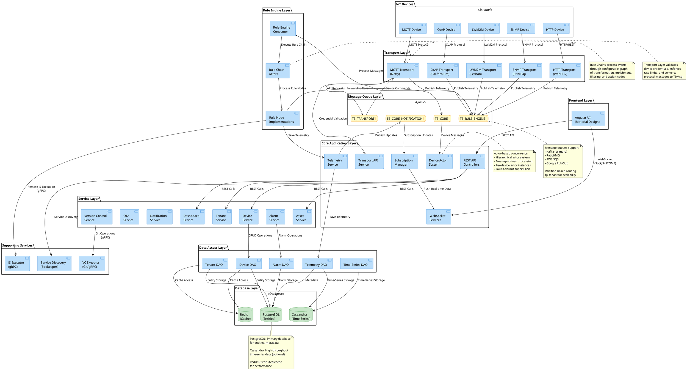

Perfect! Now I have all the information needed to create the comprehensive software architecture document with PlantUML diagram. Let me compile this into a formal architectural document:

---

# ThingsBoard Software Architecture Document

## 1. System Overview

**ThingsBoard** is an enterprise-grade, open-source IoT (Internet of Things) platform designed for comprehensive IoT solution development. The system provides:

- **Data Collection**: Multi-protocol device connectivity (MQTT, HTTP, CoAP, LWM2M, SNMP)
- **Data Processing**: Real-time event processing through configurable rule chains
- **Data Visualization**: Web-based dashboards with real-time updates and customizable widgets
- **Device Management**: Full lifecycle management of IoT devices including provisioning, credentials, OTA updates
- **Multi-Tenancy**: Isolated tenant environments with customer hierarchies
- **Scalability**: Horizontal scaling through microservices architecture

**Domain**: Internet of Things (IoT), Industrial IoT (IIoT), SCADA, Device Management, Telemetry Processing

**Version**: 4.3.0-SNAPSHOT  
**Language**: Java 17  
**Framework**: Spring Boot 3.4.8

---

## 2. Architectural Style / Pattern

ThingsBoard employs a **hybrid architectural pattern** combining multiple architectural styles:

### 2.1 Primary Architectural Patterns

1. **Microservices Architecture (MSA)**
   - Independently deployable services (tb-node, web-ui, js-executor, vc-executor, transport services)
   - Service discovery via Zookeeper
   - Inter-service communication via gRPC and message queues
   - Flexible deployment modes: monolith or distributed microservices

2. **Event-Driven Architecture (EDA)**
   - Message queue-driven processing (Kafka, RabbitMQ, AWS SQS, Google Pub/Sub)
   - Asynchronous event propagation through rule chains
   - Pub-sub pattern for telemetry, attributes, and alarms
   - Event sourcing for device activity and state changes

3. **Actor-Based Concurrency Model**
   - Custom actor framework (inspired by Akka)
   - Hierarchical actor systems for device and tenant management
   - Message-driven processing with mailbox queuing
   - Supervision strategies for fault tolerance

4. **Layered Architecture**
   - Presentation Layer: Angular 18 UI
   - Application Layer: REST API, WebSocket services
   - Domain Layer: Core business logic, rule engine
   - Data Access Layer: DAO abstraction with multiple database support
   - Transport Layer: Protocol-specific device communication

5. **Service-Oriented Architecture (SOA)**
   - Clear service boundaries with well-defined interfaces
   - Protocol-agnostic service contracts
   - Reusable services across deployment modes

---

## 3. Major Components / Modules

### 3.1 Core Modules

#### **application** - Main Application Service
- **Location**: `/application`
- **Purpose**: Monolith deployment mode and core service implementation
- **Key Components**:
  - REST API Controllers: Device, Asset, Dashboard, Tenant, User management
  - Telemetry Services: Real-time data processing and subscription management
  - Transport API Services: Device credential validation and session management
  - Queue Consumers: TB_CORE, TB_CORE_NOTIFICATION message processing
  - Rule Engine Services: Rule chain execution coordination
  - WebSocket Services: Real-time data push to UI
  - Notification Services: Email, SMS, Slack, Firebase notifications
  - TTL & Cleanup Services: Time-series and alarm retention policies
  - Version Control Services: Git-based entity versioning
  - OTA Services: Firmware/software update management
  - AI Integration: LangChain4j for AI model integration

#### **common** - Shared Infrastructure (14 sub-modules)
- **Location**: `/common`
- **Sub-modules**:
  - **data**: Core domain models, DTOs (Tenant, Device, Dashboard, Asset, Alarm, Event)
  - **proto**: Protobuf definitions for inter-service communication
  - **actor**: Custom actor-based concurrency framework
  - **message**: Internal TbMsg message protocol
  - **queue**: Message queue abstractions (Kafka, RabbitMQ, SQS, Pub/Sub)
  - **transport**: Transport layer abstractions
  - **dao-api**: Data Access Object interfaces
  - **cache**: Caching abstractions (Redis, Caffeine)
  - **cluster-api**: Cluster coordination and discovery
  - **stats**: Metrics and statistics collection
  - **coap-server**: CoAP protocol server implementation
  - **edge-api**: Edge computing functionality
  - **version-control**: Git-based entity version control
  - **script**: JavaScript/TBEL expression evaluation
  - **discovery-api**: Service discovery interfaces
  - **edqs**: Entity Data Query Service

#### **dao** - Data Access Layer
- **Location**: `/dao`
- **Purpose**: Database abstraction and persistence
- **Supported Databases**:
  - PostgreSQL (primary relational database)
  - Cassandra (high-throughput time-series)
  - TimescaleDB (alternative time-series)
  - Elasticsearch (search capability)
- **Features**:
  - Entity DAOs: Device, Asset, Dashboard, Tenant, Customer, User
  - Time-series DAOs: Telemetry and attribute storage
  - Event DAOs: Alarms, audit logs, lifecycle events
  - SQL/CQL migration scripts for schema versioning

#### **rule-engine** - Event Processing Engine
- **Location**: `/rule-engine`
- **Sub-modules**:
  - **rule-engine-api**: Core rule engine interfaces
  - **rule-engine-components**: Rule node implementations
- **Rule Node Categories**:
  - Transformation: Script, TBEL, JSON transformation
  - Enrichment: Originator attributes, related attributes, customer details
  - Filtering: Script filter, switch, message type switch
  - Action: Create alarm, clear alarm, assign to customer, RPC call
  - External: REST API call, MQTT, Kafka, RabbitMQ, email, SMS
  - Flow Control: Checkpoint, delay, rate limit
  - Analytics: Calculate delta, aggregate
  - AI: AI model inference

#### **transport** - Protocol Transport Servers
- **Location**: `/transport` and `/common/transport`
- **Supported Protocols**:
  - **MQTT**: Custom Netty-based implementation (v3.1.1, v5.0)
  - **HTTP/REST**: Spring WebFlux-based HTTP transport
  - **CoAP**: Californium-based CoAP server (RFC 7252)
  - **LWM2M**: Leshan-based LWM2M server (OMA LWM2M 1.0/1.1)
  - **SNMP**: SNMP4j-based SNMP manager
- **Features**:
  - Device authentication and authorization
  - Protocol-specific message conversion to TbMsg
  - Rate limiting and entity limits
  - Session management
  - RPC request/response handling

#### **ui-ngx** - Angular Frontend
- **Location**: `/ui-ngx`
- **Technology Stack**:
  - Angular 18
  - Angular Material Design
  - TypeScript
  - WebSocket (SockJS + STOMP)
  - Widget system for dashboards
- **Features**:
  - Real-time dashboards
  - Device and asset management UI
  - Rule chain visual editor
  - User and tenant administration
  - Alarm management
  - SCADA support
  - Mobile-responsive design

#### **msa** - Microservices Architecture Components
- **Location**: `/msa`
- **Deployable Microservices**:
  - **tb-node**: Core microservice (wraps application module)
  - **web-ui**: UI microservice (Nginx + Angular)
  - **js-executor**: Remote JavaScript execution via gRPC
  - **vc-executor**: Version control (Git) executor
  - **edqs**: Entity Data Query Service
  - **transport/mqtt, http, coap, lwm2m, snmp**: Protocol-specific transport microservices
  - **black-box-tests**: Integration test suite (Selenium, TestNG)
  - **monitoring**: Observability and metrics

#### **netty-mqtt** - Custom MQTT Protocol Implementation
- **Location**: `/netty-mqtt`
- **Purpose**: High-performance MQTT 3.1.1 and 5.0 protocol implementation
- **Features**:
  - Netty-based non-blocking I/O
  - QoS 0, 1, 2 support
  - Session persistence
  - Retained messages
  - Last will and testament

#### **rest-client** - Java REST API Client Library
- **Location**: `/rest-client`
- **Purpose**: Programmatic access to ThingsBoard REST API
- **Usage**: Testing, integration, client applications

#### **tools** - Development Utilities
- **Location**: `/tools`
- **Purpose**: Build tools, documentation generation, helper scripts

#### **monitoring** - Observability
- **Location**: `/monitoring`
- **Purpose**: Monitoring, metrics, and observability components

---

## 4. Interactions

### 4.1 Device-to-Cloud Data Flow

```
Device (MQTT/HTTP/CoAP/LWM2M/SNMP)
    ↓ [1. Transport Protocol]
Transport Service (validates credentials, rate limiting)
    ↓ [2. Publish to Queue: TransportToRuleEngineMsg]
Message Queue (Kafka/RabbitMQ/SQS/Pub/Sub)
    ↓ [3. TB_RULE_ENGINE topic]
Rule Engine Consumer (tb-node or dedicated rule-engine service)
    ↓ [4. Execute Rule Chains]
Rule Chain Actors (transformation, enrichment, filtering, actions)
    ↓ [5. Save to Database]
DAO Layer (PostgreSQL + Cassandra/TimescaleDB)
    ↓ [6. Publish Subscription Update: TbTimeSeriesUpdateProto]
Message Queue (TB_CORE_NOTIFICATION topic)
    ↓ [7. Subscription Manager]
Subscription Service (manages WebSocket subscriptions)
    ↓ [8. WebSocket Push]
Angular UI (real-time dashboard update)
```

### 4.2 Inter-Service Communication Patterns

#### **4.2.1 Message Queue Communication**
- **Queues/Topics**:
  - `TB_CORE`: Core service messages (device actor messages, state updates)
  - `TB_CORE_NOTIFICATION`: High-priority notifications (subscriptions, RPC responses)
  - `TB_RULE_ENGINE`: Rule engine processing queue
  - `TB_TRANSPORT`: Transport-to-core API requests/responses
  - Tenant-specific queues with partition support
- **Message Types** (defined in `queue.proto`):
  - `TransportToRuleEngineMsg`: Device telemetry/attributes
  - `ToCoreMsg`: Device actor notifications, lifecycle events
  - `ToCoreNotificationMsg`: Subscription updates, queue updates, RPC responses
  - `ToRuleEngineMsg`: TbMsg for rule chain processing
  - `ToTransportMsg`: Device commands, attribute updates, RPC requests

#### **4.2.2 gRPC Communication**
- **Use Cases**:
  - JavaScript execution (js-executor ↔ tb-node)
  - Version control operations (vc-executor ↔ tb-node)
  - Inter-service RPC calls in microservices mode
- **Protocol**: Protocol Buffers 3.25.5, gRPC 1.68.1

#### **4.2.3 REST API**
- **Endpoints**: `/api/[entity-type]` (device, asset, dashboard, tenant, user, etc.)
- **Authentication**: JWT tokens (9000s expiration, 604800s refresh)
- **Swagger/OpenAPI**: Documented API (SpringDoc)

#### **4.2.4 WebSocket**
- **Protocol**: SockJS + STOMP
- **Subscriptions**:
  - Telemetry subscriptions (time-series data)
  - Attribute subscriptions (latest values, scopes: CLIENT, SERVER, SHARED)
  - Alarm subscriptions (real-time alarm updates)
  - Entity data subscriptions (dashboard queries)

### 4.3 Actor System Hierarchy

```
TbActorSystem (root)
├── AppActorSystem
│   ├── TenantActorCreator (per tenant)
│   │   ├── DeviceActorCreator (per device)
│   │   │   └── DeviceActor (handles device messages, RPC, state)
│   │   ├── RuleChainActorCreator (per rule chain)
│   │   │   └── RuleChainActor (executes rule nodes)
│   │   └── RuleNodeActorCreator (per rule node in chain)
│   │       └── RuleNodeActor (processes TbMsg)
│   └── SessionActorCreator (per transport session)
│       └── SessionActor (manages device session)
```

- **Message Flow**: `TbActorRef.tell(TbActorMsg)` → Dispatcher → Mailbox → Actor.process()
- **Supervision**: Parent actors supervise children, handle failures

---

## 5. Technology Stack

### 5.1 Backend Technologies

| Category | Technology | Version |
|----------|-----------|---------|
| **Language** | Java | 17 |
| **Framework** | Spring Boot | 3.4.8 |
| **Build Tool** | Maven | Multi-module |
| **Concurrency** | Custom Actor Framework | - |
| **Message Queue** | Apache Kafka (primary) | 3.9.1 |
| | RabbitMQ | via spring-amqp |
| | AWS SQS | 1.12.701 |
| | Google Pub/Sub | 1.128.1 |
| **Databases** | PostgreSQL | via JDBC |
| | Cassandra | 4.17.0 |
| | TimescaleDB | PostgreSQL extension |
| | Elasticsearch | via REST client |
| **Caching** | Redis | Jedis 5.1.5 |
| | Caffeine | via Spring Cache |
| **RPC** | gRPC | 1.68.1 |
| **Serialization** | Protocol Buffers | 3.25.5 |
| **Security** | Spring Security | 6.x |
| | JWT | io.jsonwebtoken 0.12.5 |
| | OAuth2 | Spring Security OAuth2 |
| | BouncyCastle | 1.78.1 |
| **Monitoring** | Dropwizard Metrics | 4.2.25 |
| **Logging** | SLF4J + Logback | - |
| **Testing** | Spring Test, TestNG | 7.10.1 |
| | Testcontainers | 1.20.6 |

### 5.2 IoT Protocol Stack

| Protocol | Implementation | Version |
|----------|---------------|---------|
| **MQTT** | Custom Netty-based | - |
| **HTTP/REST** | Spring WebFlux | - |
| **CoAP** | Californium | 3.12.1 |
| **LWM2M** | Leshan | 2.0.0-M15 |
| **SNMP** | SNMP4j | 3.8.0 |

### 5.3 Frontend Technologies

| Category | Technology | Version |
|----------|-----------|---------|
| **Framework** | Angular | 18 |
| **UI Library** | Angular Material | - |
| **Language** | TypeScript | - |
| **WebSocket** | SockJS + STOMP | - |
| **Build Tool** | npm/Angular CLI | - |

### 5.4 DevOps & Deployment

| Category | Technology |
|----------|-----------|
| **Containerization** | Docker, Docker Compose |
| **Orchestration** | Kubernetes (implied) |
| **Service Discovery** | Zookeeper 3.9.3 |
| **CI/CD** | GitHub Actions (inferred) |

### 5.5 Key Dependencies

- **Apache Curator**: 5.6.0 (Zookeeper client)
- **Guava**: 33.1.0-jre
- **Apache Commons**: Lang3, IO, CSV
- **Hibernate (via Spring Data JPA)**: 6.x
- **Lombok**: 1.18.38 (code generation)
- **TBEL (ThingsBoard Expression Language)**: 1.2.8
- **Nashorn (JavaScript engine)**: 15.4
- **LangChain4j (AI integration)**: 1.1.0

---

## 6. Deployment View

### 6.1 Monolith Deployment (Single Node)

```
┌─────────────────────────────────────────────┐
│         ThingsBoard Monolith (tb)           │
│  ┌───────────────────────────────────────┐  │
│  │  Application Module                   │  │
│  │  - REST API                           │  │
│  │  - WebSocket                          │  │
│  │  - Rule Engine                        │  │
│  │  - Transport (MQTT/HTTP/CoAP/etc)     │  │
│  │  - Telemetry Services                 │  │
│  │  - All Queue Consumers                │  │
│  └───────────────────────────────────────┘  │
│  ┌───────────────────────────────────────┐  │
│  │  Angular UI (served by Spring Boot)  │  │
│  └───────────────────────────────────────┘  │
└─────────────────────────────────────────────┘
                    ↓ ↑
        ┌───────────────────────┐
        │   PostgreSQL DB       │
        │   (+ optional Cassandra) │
        └───────────────────────┘
```

### 6.2 Microservices Deployment (Distributed)

```
┌─────────────────┐     ┌─────────────────┐     ┌─────────────────┐
│  Web UI         │     │   TB-Node 1     │     │   TB-Node 2     │
│  (Nginx +       │────▶│   (Core +       │     │   (Core +       │
│   Angular)      │     │    Rule Engine) │     │    Rule Engine) │
└─────────────────┘     └─────────────────┘     └─────────────────┘
                              ↓ ↑                      ↓ ↑
                     ┌──────────────────────────────────────┐
                     │    Message Queue (Kafka Cluster)     │
                     └──────────────────────────────────────┘
                              ↓ ↑                      ↓ ↑
    ┌─────────────────┐  ┌─────────────────┐  ┌─────────────────┐
    │  MQTT Transport │  │  HTTP Transport │  │  CoAP Transport │
    │  Microservice   │  │  Microservice   │  │  Microservice   │
    └─────────────────┘  └─────────────────┘  └─────────────────┘
                              ↓ ↑
            ┌─────────────────────────────────────────┐
            │      JS Executor Microservice           │
            │      (Remote JavaScript execution)      │
            └─────────────────────────────────────────┘
                              ↓ ↑
            ┌─────────────────────────────────────────┐
            │    VC Executor Microservice             │
            │    (Git version control operations)     │
            └─────────────────────────────────────────┘
                              ↓ ↑
            ┌─────────────────────────────────────────┐
            │         Service Discovery               │
            │         (Zookeeper Cluster)             │
            └─────────────────────────────────────────┘
                              ↓ ↑
        ┌───────────────────────────────────────────────┐
        │          Database Layer                       │
        │  - PostgreSQL (primary)                       │
        │  - Cassandra (time-series, optional)          │
        │  - Redis (cache)                              │
        └───────────────────────────────────────────────┘
```

### 6.3 Deployment Characteristics

- **Flexible Deployment**: Single monolith or distributed microservices
- **Horizontal Scaling**: Scale transport, core, and rule engine independently
- **Multi-Tenancy**: Tenant isolation at application and data layers
- **High Availability**: Cluster coordination via Zookeeper
- **Load Balancing**: HAProxy/Nginx for HTTP/WebSocket, Kafka partition-based for message distribution
- **Containerization**: Docker images for all services
- **Orchestration**: Docker Compose (development), Kubernetes (production-ready)

---

## 7. UML Diagram (PlantUML)



---

## 8. Key Design Decisions & Architectural Rationale

### 8.1 Actor-Based Concurrency
**Decision**: Implement custom actor framework instead of using threading primitives  
**Rationale**: 
- Encapsulation of mutable state within actors
- Message-driven processing avoids shared memory concurrency issues
- Hierarchical supervision for fault tolerance
- High throughput with efficient thread pool utilization via dispatchers

### 8.2 Message Queue-Centric Architecture
**Decision**: All inter-component communication goes through message queues  
**Rationale**:
- Decoupling of producers and consumers
- Horizontal scalability through partition-based routing
- Durability and fault tolerance
- Support for multiple queue providers (Kafka, RabbitMQ, cloud providers)

### 8.3 Multi-Database Strategy
**Decision**: PostgreSQL for entities + Cassandra/TimescaleDB for time-series  
**Rationale**:
- PostgreSQL: ACID compliance for critical entity data, complex queries
- Cassandra: Optimized for high-volume time-series writes, horizontal scaling
- TimescaleDB: PostgreSQL extension for time-series, simpler operations
- Flexibility to choose based on deployment requirements

### 8.4 Protocol Abstraction Layer
**Decision**: Separate transport services per protocol with common abstraction  
**Rationale**:
- Protocol-specific optimizations (e.g., MQTT session state)
- Independent scaling of transport services
- Protocol isolation prevents cross-protocol issues
- Easy addition of new protocols

### 8.5 Flexible Deployment Modes
**Decision**: Support both monolith and microservices deployment  
**Rationale**:
- Monolith: Simpler deployment for small/medium installations
- Microservices: Independent scaling for high-load scenarios
- Custom annotations (`@TbCoreComponent`, `@TbRuleEngineComponent`) enable component scanning per deployment mode

### 8.6 Protobuf for Inter-Service Communication
**Decision**: Use Protocol Buffers instead of JSON for inter-service messages  
**Rationale**:
- Efficient binary serialization (smaller message size)
- Strong typing and schema evolution
- Performance-critical for high-throughput IoT scenarios
- Language-agnostic (enables polyglot microservices)

### 8.7 Multi-Tenancy at All Layers
**Decision**: Tenant context propagates through all layers (transport, queue, core, DAO)  
**Rationale**:
- Data isolation for security and compliance
- Per-tenant rate limiting and quota management
- Optional isolated rule engines for tenant-specific processing
- Scalability through tenant-based partitioning

---

## 9. Security Architecture

- **Authentication**: JWT tokens with configurable expiration
- **Authorization**: Role-based access control (RBAC) with tenant and customer hierarchy
- **Device Credentials**: Multiple types (access token, X.509 certificates, MQTT basic auth, LWM2M credentials)
- **Transport Security**: TLS/SSL support for all protocols
- **API Security**: Spring Security with OAuth2 support
- **Cryptography**: BouncyCastle for cryptographic operations
- **Rate Limiting**: Bucket4j for API and transport rate limiting

---

## 10. Scalability & Performance

- **Horizontal Scaling**: Add more tb-node, transport, or rule-engine instances
- **Partition-Based Routing**: Messages routed by tenant to specific partitions
- **Actor Hierarchy**: Device actors distributed across nodes based on hash partitioning
- **Caching**: Redis for distributed cache, Caffeine for local L1 cache
- **Database Sharding**: Cassandra's distributed architecture for time-series scaling
- **Asynchronous Processing**: Non-blocking I/O throughout the stack (Netty, Spring WebFlux)

---

## 11. High Availability & Fault Tolerance

- **Cluster Coordination**: Zookeeper for service discovery and leader election
- **Message Durability**: Kafka replication and commit logs
- **Actor Supervision**: Parent actors restart failed child actors
- **Database Replication**: PostgreSQL replication, Cassandra multi-datacenter replication
- **Graceful Degradation**: Circuit breakers for external service calls

---

## 12. Monitoring & Observability

- **Metrics**: Dropwizard Metrics exposed via JMX
- **Statistics**: Custom statistics collection (cluster stats, queue stats, API usage)
- **Logging**: SLF4J + Logback with configurable levels
- **Tracing**: Correlation IDs in TbMsg for distributed tracing
- **Health Checks**: Spring Boot Actuator endpoints

---

## Conclusion

ThingsBoard represents a mature, production-grade IoT platform with a well-architected design that balances complexity and flexibility. The hybrid architectural approach (microservices + event-driven + actor-based + layered) provides:

- **Scalability**: Horizontal scaling through microservices and message-driven architecture
- **Performance**: Actor-based concurrency and optimized time-series storage
- **Flexibility**: Multiple deployment modes, database options, and protocol support
- **Extensibility**: Plugin-based rule nodes, custom widgets, REST API
- **Reliability**: Fault-tolerant actor supervision, message durability, cluster coordination

The system is designed to handle enterprise-scale IoT deployments with millions of devices, complex event processing requirements, and stringent performance and availability requirements.

---

**Document Version**: 1.0  
**Generated**: 2025-10-16  
**ThingsBoard Version**: 4.3.0-SNAPSHOT
