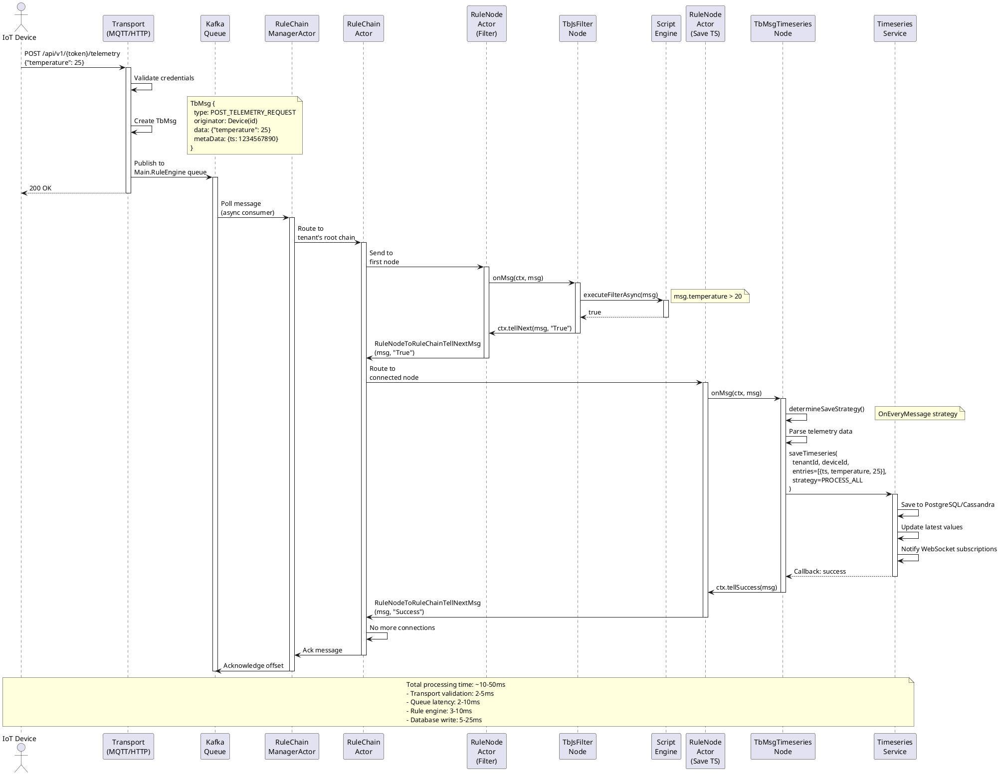

Perfect! Now I have all the information needed to generate comprehensive design documentation. Let me create the detailed design document:

# ThingsBoard Rule Engine - Design Documentation

## 1. Module Purpose

The **rule-engine** module is the event processing core of ThingsBoard IoT platform, responsible for:

- **Real-time Event Processing**: Processing telemetry data, device events, alarms, and entity lifecycle events from IoT devices
- **Data Transformation**: Converting, enriching, filtering, and manipulating messages flowing through the system
- **Business Logic Execution**: Implementing customizable rule chains that define how messages are processed, routed, and acted upon
- **Integration Orchestration**: Connecting IoT devices with external systems (cloud services, databases, message queues, notification systems)
- **Extensibility Framework**: Providing a plugin architecture allowing developers to create custom rule nodes without modifying core platform code

The module processes millions of messages per day in production environments, supporting multi-tenancy, horizontal scaling, and fault tolerance through an actor-based concurrency model.

---

## 2. Public Interfaces / APIs

### 2.1 Core API Interfaces

#### **TbNode Interface** (`rule-engine-api/src/main/java/org/thingsboard/rule/engine/api/TbNode.java:28`)

Primary contract that all rule nodes must implement:

```java
public interface TbNode {
    // Initialize node with configuration
    void init(TbContext ctx, TbNodeConfiguration configuration) throws TbNodeException;
    
    // Process incoming message (core logic)
    void onMsg(TbContext ctx, TbMsg msg) throws ExecutionException, InterruptedException, TbNodeException;
    
    // Cleanup resources
    default void destroy() {}
    
    // Handle cluster partition changes
    default void onPartitionChangeMsg(TbContext ctx, PartitionChangeMsg msg) {}
    
    // Migrate configuration across versions
    default TbPair<Boolean, JsonNode> upgrade(int fromVersion, JsonNode oldConfiguration) 
        throws TbNodeException {
        return new TbPair<>(false, oldConfiguration);
    }
}
```

**Key Methods:**
- `init()` - Parse and validate node configuration, create resources (line 30)
- `onMsg()` - Process each message asynchronously, route to next nodes (line 32)
- `destroy()` - Release resources when node is removed from chain (line 34)
- `upgrade()` - Handle backward-compatible configuration schema changes (line 50)

#### **@RuleNode Annotation** (`rule-engine-api/src/main/java/org/thingsboard/rule/engine/api/RuleNode.java:31`)

Metadata annotation for node registration and UI integration:

```java
@RuleNode(
    type = ComponentType.FILTER,              // Node category
    name = "script",                          // Display name
    relationTypes = {SUCCESS, FAILURE},       // Output connections
    configClazz = TbJsFilterNodeConfiguration.class,
    nodeDescription = "Filter incoming messages...",
    nodeDetails = "Detailed HTML description...",
    configDirective = "tbFilterNodeScriptConfig",  // Angular directive
    docUrl = "https://...",                   // Documentation link
    version = 1                               // Schema version
)
```

**Annotation Properties** (line 31-72):
- `type` - Component category: FILTER, ACTION, TRANSFORM, ENRICHMENT, EXTERNAL, FLOW (line 33)
- `relationTypes` - Output connection types (SUCCESS, FAILURE, TRUE, FALSE, etc.) (line 53)
- `configClazz` - Configuration class for deserialization (line 41)
- `clusteringMode` - ENABLED (distributed) or USER_PREFERENCE (line 43)
- `version` - Schema version for configuration upgrades (line 71)
- `ruleChainTypes` - Applicable to CORE and/or EDGE chains (line 69)

#### **TbContext Interface** (`rule-engine-api/src/main/java/org/thingsboard/rule/engine/api/TbContext.java:100`)

Comprehensive execution context providing 441 lines of API surface:

**Message Flow Control** (line 108-199):
```java
void tellSuccess(TbMsg msg);                          // Route to SUCCESS connections
void tellNext(TbMsg msg, String relationType);        // Route to specific connection
void tellFailure(TbMsg msg, Throwable th);            // Handle errors
void tellSelf(TbMsg msg, long delayMs);               // Delayed re-processing
void input(TbMsg msg, RuleChainId ruleChainId);       // Call nested rule chain
void output(TbMsg msg, String relationType);          // Return from nested chain
void ack(TbMsg msg);                                  // Terminate processing
void enqueue(TbMsg msg, Runnable onSuccess, ...);     // Queue for async processing
```

**Message Creation** (line 218-246):
```java
TbMsg newMsg(String queueName, TbMsgType type, EntityId originator, ...);
TbMsg transformMsg(TbMsg origMsg, TbMsgType type, ...);
TbMsg deviceCreatedMsg(Device device, RuleNodeId ruleNodeId);
TbMsg alarmActionMsg(Alarm alarm, RuleNodeId ruleNodeId, TbMsgType actionMsgType);
TbMsg attributesUpdatedActionMsg(EntityId originator, ...);
```

**Service Access** (line 272-439) - 40+ service getters:
```java
// Entity Services
DeviceService getDeviceService();
AssetService getAssetService();
CustomerService getCustomerService();

// Data Services
AttributesService getAttributesService();
TimeseriesService getTimeseriesService();
RelationService getRelationService();

// Alarm Management
RuleEngineAlarmService getAlarmService();
AlarmCommentService getAlarmCommentService();

// Communication
RuleEngineRpcService getRpcService();
MailService getMailService(boolean isSystem);
SmsService getSmsService();
NotificationCenter getNotificationCenter();
SlackService getSlackService();

// Execution
ListeningExecutor getDbCallbackExecutor();
ListeningExecutor getExternalCallExecutor();
ListeningExecutor getMailExecutor();

// Scripting
ScriptEngine createScriptEngine(ScriptLanguage lang, String script, String... argNames);
```

### 2.2 Service Interfaces for Rule Nodes

#### **RuleEngineAlarmService** (`rule-engine-api/src/main/java/org/thingsboard/rule/engine/api/RuleEngineAlarmService.java`)

Alarm lifecycle management:
- `createOrUpdateAlarm()` - Create/update alarms with severity, type, details
- `createAlarm()` - Create new alarm
- `acknowledgeAlarm()` - Mark alarm as acknowledged
- `clearAlarm()` - Clear alarm state
- `deleteAlarm()` - Permanently delete alarm

#### **RuleEngineRpcService** (`rule-engine-api/src/main/java/org/thingsboard/rule/engine/api/RuleEngineRpcService.java`)

Device RPC communication:
- `sendRpcRequestToDevice()` - Send command to device, get async response
- `sendRpcReplyToDevice()` - Reply to device-originated RPC

#### **RuleEngineTelemetryService** (`rule-engine-api/src/main/java/org/thingsboard/rule/engine/api/RuleEngineTelemetryService.java`)

Telemetry data persistence:
- `saveTimeseries()` - Save time-series data with TTL and processing strategies
- `deleteTimeseries()` - Delete historical telemetry
- `saveAndNotify()` - Save with WebSocket notifications

#### **ScriptEngine** (`rule-engine-api/src/main/java/org/thingsboard/rule/engine/api/ScriptEngine.java`)

JavaScript/TBEL script execution:
- `executeAsync()` - Execute script with message context
- `executeFilterAsync()` - Execute boolean filter script
- `executeUpdateAsync()` - Execute transformation script

### 2.3 Configuration API

#### **NodeConfiguration Interface** (`rule-engine-api/src/main/java/org/thingsboard/rule/engine/api/NodeConfiguration.java`)

Base interface for all node configurations - marker interface for Jackson deserialization.

**Example Implementations:**
- `TbJsFilterNodeConfiguration` - Script language, script text
- `TbMsgTimeseriesNodeConfiguration` - TTL, server timestamp flag, processing settings
- `TbRestApiCallNodeConfiguration` - URL, method, headers, request body template

---

## 3. Internal Design

### 3.1 Module Structure

The rule-engine module consists of two Maven sub-modules:

```
rule-engine/
├── rule-engine-api/           # Public API and contracts (40 files)
│   ├── TbNode.java            # Core interface
│   ├── TbContext.java         # Execution context
│   ├── RuleNode.java          # Metadata annotation
│   └── [service interfaces]   # RuleEngineAlarmService, RuleEngineRpcService, etc.
│
└── rule-engine-components/    # 89 built-in rule nodes
    ├── action/                # Data persistence nodes (14 nodes)
    ├── filter/                # Conditional routing (10 nodes)
    ├── transform/             # Data transformation (12 nodes)
    ├── enrichment/            # Metadata enrichment (15 nodes)
    ├── external/              # 3rd party integration (20 nodes)
    ├── flow/                  # Control flow (6 nodes)
    ├── rpc/                   # Device RPC (2 nodes)
    ├── ai/                    # LangChain4J integration (1 node)
    ├── geo/                   # Geospatial processing (3 nodes)
    ├── util/                  # Utility nodes (6 nodes)
    └── [19 more categories]
```

### 3.2 Key Classes and Components

#### **Actor System Integration** (application module)

**RuleChainActor** (`application/src/main/java/org/thingsboard/server/actors/ruleChain/RuleChainActor.java`)

Manages execution of a complete rule chain:
- Maintains graph of connected rule nodes
- Routes messages between nodes based on relation types
- Handles nested rule chain invocations
- Manages lifecycle (init, start, stop, destroy)
- Processes cluster partition changes

**RuleNodeActor** (`application/src/main/java/org/thingsboard/server/actors/ruleChain/RuleNodeActor.java`)

Executes individual rule node logic:
- Wraps TbNode implementation
- Provides single-threaded execution guarantee (actor model)
- Handles exceptions and routes failures
- Manages node state persistence

**DefaultTbContext** (`application/src/main/java/org/thingsboard/server/actors/ruleChain/DefaultTbContext.java`)

Implements TbContext interface (1,110 lines):
- Bridges actor system with rule node API
- Lazy-initializes service dependencies
- Translates method calls to actor messages
- Manages callback executors for async operations

### 3.3 Message Processing Architecture

#### **Message Flow Sequence**

```
IoT Device → Transport Layer (MQTT/HTTP/CoAP/LWM2M)
    ↓
Message Queue (Kafka/RabbitMQ) - persistence & scalability
    ↓
RuleEngineConsumer - pulls messages from queue
    ↓
RuleChainManagerActor - routes to appropriate RuleChainActor
    ↓
RuleChainActor - determines first node(s) to execute
    ↓
RuleNodeActor₁ - executes TbNode.onMsg()
    ↓
TbContext.tellNext(msg, "Success") - routes to connected nodes
    ↓
RuleNodeActor₂, RuleNodeActor₃ - parallel execution of connected nodes
    ↓
... continues until termination (ack/failure)
    ↓
Message acknowledged to queue
```

#### **Actor Hierarchy**

```
TbActorSystem
└── RuleChainManagerActor (one per tenant)
    ├── RuleChainActor (tenant:default-chain)
    │   ├── RuleNodeActor (node:filter-1)
    │   ├── RuleNodeActor (node:transform-1)
    │   └── RuleNodeActor (node:save-telemetry)
    │
    └── RuleChainActor (tenant:alarms-chain)
        ├── RuleNodeActor (node:create-alarm)
        └── RuleNodeActor (node:send-email)
```

### 3.4 Key Data Structures

#### **TbMsg** (common/message module)

Immutable message container:
```java
class TbMsg {
    UUID id;                      // Unique message ID
    TbMsgType type;               // POST_TELEMETRY_REQUEST, ALARM_ACK, etc.
    EntityId originator;          // Device/Asset/Customer/Tenant
    CustomerId customerId;        // Customer association
    TbMsgMetaData metaData;       // Key-value metadata (timestamp, headers, etc.)
    String data;                  // JSON payload
    RuleChainId ruleChainId;      // Processing context
    RuleNodeId ruleNodeId;        // Current node
}
```

#### **RuleNodeState** (DAO layer)

Persistent node state for stateful nodes (e.g., rate limiters, aggregators):
```java
class RuleNodeState {
    RuleNodeId ruleNodeId;
    EntityId entityId;            // State scoped to entity
    JsonNode stateData;           // Arbitrary JSON state
}
```

### 3.5 Design Patterns

#### **1. Strategy Pattern - Processing Strategies**

Example: `TbMsgTimeseriesNode` (`rule-engine-components/src/main/java/org/thingsboard/rule/engine/telemetry/TbMsgTimeseriesNode.java:107`)

```java
sealed interface TimeseriesProcessingSettings {
    record OnEveryMessage() implements TimeseriesProcessingSettings {}
    record Deduplicate(ProcessingStrategy strategy) implements TimeseriesProcessingSettings {}
    record WebSocketsOnly() implements TimeseriesProcessingSettings {}
    record Advanced(
        ProcessingStrategy timeseries,
        ProcessingStrategy latest,
        ProcessingStrategy webSockets,
        ProcessingStrategy calculatedFields
    ) implements TimeseriesProcessingSettings {}
}
```

Allows independent control of:
- Time-series database writes
- Latest value updates
- WebSocket notifications
- Calculated field triggers

Each can be: **On Every Message**, **Deduplicate** (with interval), or **Skip**.

#### **2. Template Method Pattern - Node Lifecycle**

All nodes follow the same lifecycle managed by RuleNodeActor:
1. `init()` - Parse configuration, create resources
2. `onMsg()` - Process messages (called repeatedly)
3. `onPartitionChangeMsg()` - Handle cluster rebalancing
4. `destroy()` - Cleanup resources

#### **3. Chain of Responsibility - Rule Chain Execution**

Messages flow through connected nodes:
```
Filter Node → Transform Node → Enrichment Node → Action Node
    ↓ FALSE       ↓ SUCCESS       ↓ SUCCESS        ↓ SUCCESS
Debug Node    Alt Transform    Database Node    Send Email
```

Each node decides next node(s) via `ctx.tellNext(msg, relationType)`.

#### **4. Async Callback Pattern**

All I/O operations use Guava `ListenableFuture` with callbacks:

```java
public void onMsg(TbContext ctx, TbMsg msg) {
    withCallback(
        asyncOperation(),                    // Returns ListenableFuture
        successResult -> {
            ctx.tellNext(msg, SUCCESS);      // Success path
        },
        error -> {
            ctx.tellFailure(msg, error);     // Error path
        },
        ctx.getDbCallbackExecutor()          // Executor for callbacks
    );
}
```

Benefits:
- Non-blocking actor execution
- Thread pool isolation for I/O
- Automatic error handling

#### **5. Configuration Versioning Pattern**

Nodes implement `upgrade()` for backward compatibility:

```java
@Override
public TbPair<Boolean, JsonNode> upgrade(int fromVersion, JsonNode oldConfiguration) {
    boolean hasChanges = false;
    switch (fromVersion) {
        case 0:
            // Migrate v0 → v1: rename field, add defaults
            hasChanges = true;
            ((ObjectNode) oldConfiguration).set("newField", defaultValue);
            break;
    }
    return new TbPair<>(hasChanges, oldConfiguration);
}
```

### 3.6 Built-in Node Categories (89 Total Nodes)

| Category | Count | Examples | Purpose |
|----------|-------|----------|---------|
| **FILTER** | 10 | TbJsFilterNode, TbMsgTypeFilterNode, TbOriginatorTypeSwitchNode | Conditional routing based on message content, type, or originator |
| **TRANSFORM** | 12 | TbTransformMsgNode, TbChangeOriginatorNode, TbJsonPathNode | Data manipulation, field extraction, message transformation |
| **ENRICHMENT** | 15 | TbGetAttributesNode, TbGetTelemetryNode, TbGetRelatedAttributeNode | Fetch additional data from database to enrich messages |
| **ACTION** | 14 | TbMsgTimeseriesNode, TbMsgAttributesNode, TbCreateAlarmNode | Persist data, create/clear alarms, manage entities |
| **EXTERNAL** | 20 | TbRestApiCallNode, TbKafkaNode, TbAwsLambdaNode, TbMailNode | Integrate with external systems (REST, Kafka, AWS, Azure, email) |
| **FLOW** | 6 | TbRuleChainInputNode, TbRuleChainOutputNode, TbAckNode | Control flow between rule chains |
| **RPC** | 2 | TbSendRPCRequestNode, TbSendRPCReplyNode | Device communication |
| **AI** | 1 | TbAiNode | LangChain4J LLM integration |
| **GEO** | 3 | Geofencing, distance calculation | Geospatial processing |
| **PROFILE** | 2 | TbDeviceProfileNode, TbDeviceStateNode | Profile-based logic, state machines |
| **Others** | 14 | Debug, delay, deduplication, math, calculated fields | Utility and specialized functions |

---

## 4. Dependencies

### 4.1 Internal Module Dependencies

**rule-engine-api** depends on:
- `common/message` - TbMsg, TbMsgType, message abstractions
- `common/dao-api` - Service interfaces (DeviceService, AssetService, etc.)
- `common/cluster-api` - Cluster coordination interfaces
- `common/util` - Utility classes, ListeningExecutor
- `dao` - Data access layer implementations
- `application/actors` - Actor system integration (runtime)

**rule-engine-components** depends on:
- `rule-engine-api` - Core interfaces and annotations
- `dao` - Database access for enrichment/persistence nodes
- `common/transport-api` - Transport layer abstractions
- `common/util` - Utility classes

### 4.2 External Dependencies

**Core Libraries** (`rule-engine-api/pom.xml:40-115`):
```xml
<!-- Networking -->
io.netty:netty-all
io.netty:netty-tcnative-boringssl-static

<!-- Utilities -->
com.google.guava:guava
com.fasterxml.jackson:jackson-databind

<!-- Logging -->
ch.qos.logback:logback-core
ch.qos.logback:logback-classic

<!-- Database -->
com.datastax.oss:java-driver-core (Cassandra)
org.springframework.data:spring-data-redis

<!-- Email -->
com.sun.mail:jakarta.mail

<!-- AI -->
dev.langchain4j:langchain4j
```

**Integration Libraries** (`rule-engine-components/pom.xml:40-160`):
```xml
<!-- HTTP/WebSockets -->
org.springframework.boot:spring-boot-starter-webflux
io.projectreactor.netty:reactor-netty-http

<!-- Message Queues -->
org.apache.kafka:kafka-clients
com.rabbitmq:amqp-client

<!-- Cloud Services -->
com.amazonaws:aws-java-sdk-sns
com.amazonaws:aws-java-sdk-lambda
com.google.cloud:google-cloud-pubsub

<!-- MQTT -->
org.thingsboard:netty-mqtt (custom implementation)

<!-- Utilities -->
net.objecthunter:exp4j (mathematical expressions)
com.jayway.jsonpath:json-path (JSONPath queries)
org.bouncycastle:bcpkix-jdk18on (cryptography)
```

### 4.3 Runtime Dependencies

**Spring Boot Services** (injected via TbContext):
- DeviceService, AssetService, CustomerService - Entity management
- AttributesService, TimeseriesService - Data persistence
- RuleChainService - Rule chain management
- AlarmService - Alarm lifecycle
- NotificationCenter - Notification orchestration

**Execution Infrastructure**:
- TbActorSystem - Actor-based concurrency
- QueueService - Message queue abstraction (Kafka/RabbitMQ/AWS SQS/Google Pub/Sub)
- ClusterService - Distributed coordination (Zookeeper)
- Cache - Redis/Caffeine for device profiles and attributes

---

## 5. Data Flow / Sequence

### 5.1 Typical Message Processing Flow

```
┌──────────────┐
│ IoT Device   │ sends telemetry via MQTT
└──────┬───────┘
       │
       ▼
┌──────────────────────┐
│ MQTT Transport       │ validates credentials, creates TbMsg
└──────┬───────────────┘
       │
       │ publishes to Kafka topic
       ▼
┌──────────────────────┐
│ Kafka Queue          │ durably stores message
└──────┬───────────────┘
       │
       │ RuleEngineConsumer polls
       ▼
┌──────────────────────────┐
│ RuleChainManagerActor    │ routes to tenant's root rule chain
└──────┬───────────────────┘
       │
       │ sends RuleChainToRuleNodeMsg
       ▼
┌──────────────────────────┐
│ RuleChainActor           │ determines first node (e.g., "Message Type Switch")
└──────┬───────────────────┘
       │
       │ sends RuleNodeToRuleNodeMsg
       ▼
┌──────────────────────────┐
│ RuleNodeActor (Filter)   │ TbMsgTypeFilterNode.onMsg()
└──────┬───────────────────┘   routes to "Post Telemetry" connection
       │
       │ ctx.tellNext(msg, "Post Telemetry")
       ▼
┌──────────────────────────┐
│ RuleNodeActor (Save TS)  │ TbMsgTimeseriesNode.onMsg()
└──────┬───────────────────┘   saves to PostgreSQL/Cassandra
       │
       │ async DB operation completes
       │ ctx.tellSuccess(msg)
       ▼
┌──────────────────────────┐
│ RuleNodeActor (WS Push)  │ TbWebSocketNode.onMsg()
└──────┬───────────────────┘   notifies dashboard subscriptions
       │
       │ ctx.ack(msg)
       ▼
┌──────────────────────────┐
│ Kafka Acknowledgment     │ message processing complete
└──────────────────────────┘
```

### 5.2 Nested Rule Chain Invocation

```
Main Rule Chain:
  Filter Node → ctx.input(msg, alarmChainId)
                      │
                      ▼
                Alarm Processing Rule Chain:
                  Create Alarm Node → Send Email Node → ctx.output(msg, "Success")
                                                                    │
                                                                    ▼
Main Rule Chain:                                              ◄───┘
  Continue Processing → Save Audit Log
```

**Sequence:**
1. Main chain node calls `ctx.input(msg, nestedChainId)`
2. RuleChainActor pushes current context onto processing stack
3. Nested RuleChainActor processes message
4. Nested chain node calls `ctx.output(msg, relationType)`
5. RuleChainActor pops stack, returns to caller
6. Main chain continues from original node's connection

### 5.3 Error Handling Flow

```
Node.onMsg() throws Exception
       │
       │ caught by RuleNodeActor
       ▼
ctx.tellFailure(msg, exception)
       │
       ├─→ Routes to "Failure" connections (if any)
       │       │
       │       ▼
       │   Failure Handler Node (e.g., Log Error, Send Alert)
       │
       └─→ If no failure connections:
           Logs error, acknowledges message (prevents infinite retry)
```

### 5.4 Asynchronous Operation Pattern

```java
// Example: REST API Call Node

public void onMsg(TbContext ctx, TbMsg msg) {
    // 1. Build HTTP request (synchronous, fast)
    HttpRequest request = buildRequest(config, msg);
    
    // 2. Execute async HTTP call (returns ListenableFuture)
    ListenableFuture<HttpResponse> future = httpClient.execute(request);
    
    // 3. Register callbacks
    withCallback(
        future,
        response -> {
            // 4a. Success: transform message and continue
            TbMsg responseMsg = createResponseMsg(msg, response);
            ctx.tellNext(responseMsg, SUCCESS);
        },
        error -> {
            // 4b. Error: route to failure
            ctx.tellFailure(msg, error);
        },
        ctx.getExternalCallExecutor()  // Run callbacks on dedicated thread pool
    );
    
    // 5. Return immediately (non-blocking)
    // Actor can process other messages while waiting for HTTP response
}
```

**Thread Model:**
- **Actor Thread**: Executes `onMsg()`, sets up async operation, returns immediately
- **I/O Thread Pool**: Executes network/database operations
- **Callback Executor**: Executes success/failure callbacks, sends next message

---

## 6. UML Class Diagram

```plantuml
@startuml ThingsBoard Rule Engine - Class Diagram

!define INTERFACE_COLOR #E1F5FE
!define CLASS_COLOR #FFF3E0
!define ACTOR_COLOR #F3E5F5
!define CONFIG_COLOR #E8F5E9

' Core API Interfaces
interface TbNode <<interface>> INTERFACE_COLOR {
    +init(ctx: TbContext, config: TbNodeConfiguration)
    +onMsg(ctx: TbContext, msg: TbMsg)
    +destroy()
    +onPartitionChangeMsg(ctx: TbContext, msg: PartitionChangeMsg)
    +upgrade(fromVersion: int, oldConfig: JsonNode): TbPair
}

interface NodeConfiguration <<interface>> CONFIG_COLOR {
    ' Marker interface for Jackson deserialization
}

annotation RuleNode {
    +type: ComponentType
    +name: String
    +relationTypes: String[]
    +configClazz: Class
    +nodeDescription: String
    +version: int
    +docUrl: String
}

interface TbContext <<interface>> INTERFACE_COLOR {
    ' Message Flow Control
    +tellSuccess(msg: TbMsg)
    +tellNext(msg: TbMsg, relationType: String)
    +tellFailure(msg: TbMsg, th: Throwable)
    +tellSelf(msg: TbMsg, delayMs: long)
    +input(msg: TbMsg, chainId: RuleChainId)
    +output(msg: TbMsg, relationType: String)
    +ack(msg: TbMsg)
    +enqueue(msg: TbMsg, onSuccess: Runnable, onFailure: Consumer)
    
    ' Message Creation
    +newMsg(queueName: String, type: TbMsgType, ...): TbMsg
    +transformMsg(origMsg: TbMsg, ...): TbMsg
    +deviceCreatedMsg(device: Device, ...): TbMsg
    
    ' Service Access (40+ getters)
    +getDeviceService(): DeviceService
    +getAttributesService(): AttributesService
    +getTimeseriesService(): TimeseriesService
    +getAlarmService(): RuleEngineAlarmService
    +getRpcService(): RuleEngineRpcService
    +getDbCallbackExecutor(): ListeningExecutor
    +createScriptEngine(lang: ScriptLanguage, ...): ScriptEngine
}

' Service Interfaces
interface RuleEngineAlarmService <<interface>> INTERFACE_COLOR {
    +createOrUpdateAlarm(alarm: Alarm): ListenableFuture<Alarm>
    +createAlarm(alarm: Alarm): ListenableFuture<Alarm>
    +acknowledgeAlarm(tenantId: TenantId, alarmId: AlarmId): ListenableFuture<Alarm>
    +clearAlarm(tenantId: TenantId, alarmId: AlarmId): ListenableFuture<Alarm>
    +deleteAlarm(tenantId: TenantId, alarmId: AlarmId): ListenableFuture<Boolean>
}

interface RuleEngineRpcService <<interface>> INTERFACE_COLOR {
    +sendRpcRequestToDevice(request: RuleEngineDeviceRpcRequest): ListenableFuture<RuleEngineDeviceRpcResponse>
    +sendRpcReplyToDevice(customerId: CustomerId, deviceId: DeviceId, ...): void
}

interface RuleEngineTelemetryService <<interface>> INTERFACE_COLOR {
    +saveTimeseries(request: TimeseriesSaveRequest): void
    +deleteTimeseries(tenantId: TenantId, entityId: EntityId, ...): ListenableFuture<Void>
    +saveAndNotify(tenantId: TenantId, entityId: EntityId, ...): ListenableFuture<Void>
}

interface ScriptEngine <<interface>> INTERFACE_COLOR {
    +executeAsync(msg: TbMsg): ListenableFuture<TbMsg>
    +executeFilterAsync(msg: TbMsg): ListenableFuture<Boolean>
    +executeUpdateAsync(msg: TbMsg): ListenableFuture<TbMsg>
    +destroy(): void
}

' Actor System
class RuleChainActor <<actor>> ACTOR_COLOR {
    -ruleChainId: RuleChainId
    -nodeActors: Map<RuleNodeId, RuleNodeActor>
    -connections: Map<RuleNodeId, List<Connection>>
    
    +process(msg: RuleChainToRuleNodeMsg)
    +routeToNextNodes(msg: TbMsg, relationType: String)
    +handleNestedChainInput(msg: TbMsg, chainId: RuleChainId)
    +handleNestedChainOutput(msg: TbMsg, relationType: String)
}

class RuleNodeActor <<actor>> ACTOR_COLOR {
    -ruleNodeId: RuleNodeId
    -tbNode: TbNode
    -context: DefaultTbContext
    
    +init()
    +process(msg: RuleNodeToRuleNodeMsg)
    +handleException(msg: TbMsg, ex: Exception)
}

class DefaultTbContext <<implementation>> CLASS_COLOR {
    -ruleChainActor: RuleChainActor
    -ruleNodeId: RuleNodeId
    -serviceRegistry: ServiceRegistry
    
    +tellSuccess(msg: TbMsg)
    +tellNext(msg: TbMsg, relationType: String)
    +getDeviceService(): DeviceService
    ' ... implements all TbContext methods
}

' Example Rule Nodes
class TbJsFilterNode <<node>> CLASS_COLOR {
    -scriptEngine: ScriptEngine
    
    +init(ctx: TbContext, config: TbNodeConfiguration)
    +onMsg(ctx: TbContext, msg: TbMsg)
    +destroy()
}

class TbMsgTimeseriesNode <<node>> CLASS_COLOR {
    -config: TbMsgTimeseriesNodeConfiguration
    -processingSettings: TimeseriesProcessingSettings
    
    +init(ctx: TbContext, config: TbNodeConfiguration)
    +onMsg(ctx: TbContext, msg: TbMsg)
    -determineSaveStrategy(ts: long, originatorId: UUID): Strategy
    +upgrade(fromVersion: int, oldConfig: JsonNode): TbPair
}

class TbRestApiCallNode <<node>> CLASS_COLOR {
    -restTemplate: RestTemplate
    -config: TbRestApiCallNodeConfiguration
    
    +init(ctx: TbContext, config: TbNodeConfiguration)
    +onMsg(ctx: TbContext, msg: TbMsg)
}

class TbGetAttributesNode <<node>> CLASS_COLOR {
    -config: TbGetAttributesNodeConfiguration
    
    +init(ctx: TbContext, config: TbNodeConfiguration)
    +onMsg(ctx: TbContext, msg: TbMsg)
}

' Configuration Classes
class TbJsFilterNodeConfiguration <<config>> CONFIG_COLOR {
    +scriptLang: ScriptLanguage
    +jsScript: String
    +tbelScript: String
}

class TbMsgTimeseriesNodeConfiguration <<config>> CONFIG_COLOR {
    +defaultTTL: long
    +useServerTs: boolean
    +processingSettings: TimeseriesProcessingSettings
}

class TbRestApiCallNodeConfiguration <<config>> CONFIG_COLOR {
    +restEndpointUrlPattern: String
    +requestMethod: String
    +headers: Map<String, String>
    +maxParallelRequests: int
}

' Message Classes
class TbMsg <<data>> CLASS_COLOR {
    +id: UUID
    +type: TbMsgType
    +originator: EntityId
    +customerId: CustomerId
    +metaData: TbMsgMetaData
    +data: String
    +ruleChainId: RuleChainId
    +ruleNodeId: RuleNodeId
}

' Relationships
TbNode <|.. TbJsFilterNode
TbNode <|.. TbMsgTimeseriesNode
TbNode <|.. TbRestApiCallNode
TbNode <|.. TbGetAttributesNode

TbJsFilterNode ..> RuleNode : <<annotated>>
TbMsgTimeseriesNode ..> RuleNode : <<annotated>>
TbRestApiCallNode ..> RuleNode : <<annotated>>

TbNode ..> TbContext : uses
TbNode ..> NodeConfiguration : uses

NodeConfiguration <|.. TbJsFilterNodeConfiguration
NodeConfiguration <|.. TbMsgTimeseriesNodeConfiguration
NodeConfiguration <|.. TbRestApiCallNodeConfiguration

TbContext <-- DefaultTbContext : implements
DefaultTbContext --> RuleChainActor : communicates with

RuleChainActor --> RuleNodeActor : manages
RuleNodeActor --> TbNode : wraps
RuleNodeActor --> DefaultTbContext : provides

TbContext ..> RuleEngineAlarmService : provides
TbContext ..> RuleEngineRpcService : provides
TbContext ..> RuleEngineTelemetryService : provides
TbContext ..> ScriptEngine : creates

TbJsFilterNode --> ScriptEngine : uses
TbMsgTimeseriesNode --> RuleEngineTelemetryService : uses via ctx

TbNode ..> TbMsg : processes

note right of TbNode
  All rule nodes implement TbNode
  and are annotated with @RuleNode.
  
  89 built-in nodes across
  29 functional categories.
end note

note left of TbContext
  Comprehensive API providing:
  - Message routing (8 methods)
  - Message creation (7 methods)
  - Service access (40+ getters)
  - Execution control
end note

note bottom of RuleChainActor
  Actor-based concurrency:
  - Single-threaded per actor
  - Message-driven
  - Non-blocking async I/O
end note

@enduml
```



---

## 7. Component Diagram

```plantuml
@startuml ThingsBoard Rule Engine - Component Diagram

!define MODULE_COLOR #E3F2FD
!define COMPONENT_COLOR #FFF9C4
!define EXTERNAL_COLOR #FFEBEE

package "rule-engine Module" {
    
    package "rule-engine-api" <<module>> MODULE_COLOR {
        [TbNode Interface] as TbNode
        [TbContext Interface] as TbContext
        [@RuleNode Annotation] as RuleNode
        [Service Interfaces] as Services
        
        TbNode -[hidden]- TbContext
        TbContext -[hidden]- Services
    }
    
    package "rule-engine-components" <<module>> MODULE_COLOR {
        [Filter Nodes] as Filters
        [Transform Nodes] as Transforms
        [Enrichment Nodes] as Enrichments
        [Action Nodes] as Actions
        [External Nodes] as Externals
        [Flow Nodes] as Flows
        [89 Built-in Nodes] as Nodes
        
        Filters -[hidden]- Transforms
        Transforms -[hidden]- Enrichments
        Enrichments -[hidden]- Actions
        Actions -[hidden]- Externals
    }
}

package "application Module" {
    [Actor System] as Actors
    [RuleChainActor] as ChainActor
    [RuleNodeActor] as NodeActor
    [DefaultTbContext] as CtxImpl
    
    Actors --> ChainActor
    ChainActor --> NodeActor
    NodeActor --> CtxImpl
}

package "common Module" {
    [TbMsg] as Message
    [Queue Service] as Queue
    [Service Implementations] as ServiceImpl
}

package "dao Module" {
    [AttributesService]
    [TimeseriesService]
    [DeviceService]
    [AlarmService]
}

package "External Integrations" <<external>> EXTERNAL_COLOR {
    [Kafka/RabbitMQ]
    [AWS Services]
    [Google Cloud]
    [MQTT Broker]
    [REST APIs]
    [Email/SMS]
}

' Dependencies
rule-engine-components --> rule-engine-api : implements

Nodes ..> TbNode : implements
Nodes ..> RuleNode : annotated with
Nodes ..> TbContext : uses

NodeActor --> Nodes : wraps
CtxImpl ..> TbContext : implements

CtxImpl --> ChainActor : sends messages
CtxImpl --> ServiceImpl : delegates

Actors --> Queue : consumes messages
Actors --> Message : processes

Services ..> dao : delegates to

Externals --> Queue : publish to
Externals --> REST : call
Externals --> Email/SMS : send

Nodes --> "External Integrations" : integrate with

note right of rule-engine-api
  Public API defining:
  - Node contract (TbNode)
  - Execution context (TbContext)
  - Service interfaces
  - Configuration schema
end note

note right of rule-engine-components
  89 built-in implementations:
  - FILTER (10 nodes)
  - TRANSFORM (12 nodes)
  - ENRICHMENT (15 nodes)
  - ACTION (14 nodes)
  - EXTERNAL (20 nodes)
  - Others (18 nodes)
end note

note left of Actors
  Actor-based execution:
  - Message-driven
  - Single-threaded per actor
  - Async I/O with callbacks
  - Cluster-aware
end note

@enduml
```

---

## 8. Sequence Diagram: Message Processing



---

## 9. Extension Points

### 9.1 Creating Custom Rule Nodes

**Step 1: Implement TbNode Interface**

```java
package com.example.customnodes;

import org.thingsboard.rule.engine.api.*;
import org.thingsboard.server.common.data.plugin.ComponentType;

@RuleNode(
    type = ComponentType.TRANSFORM,
    name = "Custom Data Transformer",
    relationTypes = {TbNodeConnectionType.SUCCESS, TbNodeConnectionType.FAILURE},
    configClazz = CustomTransformerConfiguration.class,
    nodeDescription = "Transforms data using custom business logic",
    nodeDetails = "Detailed HTML description for UI...",
    version = 1
)
public class CustomTransformerNode implements TbNode {
    
    private CustomTransformerConfiguration config;
    
    @Override
    public void init(TbContext ctx, TbNodeConfiguration configuration) throws TbNodeException {
        this.config = TbNodeUtils.convert(configuration, CustomTransformerConfiguration.class);
        // Initialize resources (HTTP clients, caches, etc.)
    }
    
    @Override
    public void onMsg(TbContext ctx, TbMsg msg) {
        // Synchronous processing
        try {
            String transformedData = transformData(msg.getData(), config);
            TbMsg outputMsg = ctx.transformMsg(msg, msg.getType(), msg.getOriginator(),
                                               msg.getMetaData(), transformedData);
            ctx.tellSuccess(outputMsg);
        } catch (Exception e) {
            ctx.tellFailure(msg, e);
        }
        
        // OR Asynchronous processing
        withCallback(
            asyncTransformOperation(msg),
            result -> ctx.tellNext(result, SUCCESS),
            error -> ctx.tellFailure(msg, error),
            ctx.getExternalCallExecutor()
        );
    }
    
    @Override
    public void destroy() {
        // Cleanup resources
    }
}
```

**Step 2: Create Configuration Class**

```java
public class CustomTransformerConfiguration implements NodeConfiguration {
    private String transformationType;
    private Map<String, String> parameters;
    
    // Getters/setters for JSON deserialization
}
```

**Step 3: Package and Deploy**

- Package as JAR with `@RuleNode` annotation
- Place in `extensions/` directory or include in `rule-engine-components` module
- Spring Boot auto-discovers via classpath scanning
- Node appears in UI's rule node palette

### 9.2 Common Extension Patterns

**Pattern 1: REST API Integration**
```java
public void onMsg(TbContext ctx, TbMsg msg) {
    RestTemplate restTemplate = ctx.getRestTemplate();
    
    HttpEntity<String> request = new HttpEntity<>(msg.getData(), headers);
    
    ListenableFuture<ResponseEntity<String>> future = 
        restTemplate.exchange(url, HttpMethod.POST, request, String.class);
    
    withCallback(future,
        response -> ctx.tellNext(createResponseMsg(msg, response), SUCCESS),
        error -> ctx.tellFailure(msg, error),
        ctx.getExternalCallExecutor()
    );
}
```

**Pattern 2: Database Enrichment**
```java
public void onMsg(TbContext ctx, TbMsg msg) {
    AttributesService attrService = ctx.getAttributesService();
    
    ListenableFuture<List<AttributeKvEntry>> future = 
        attrService.find(ctx.getTenantId(), msg.getOriginator(), 
                        DataConstants.SERVER_SCOPE, List.of("location", "type"));
    
    withCallback(future,
        attributes -> {
            TbMsgMetaData enrichedMetadata = msg.getMetaData().copy();
            attributes.forEach(attr -> 
                enrichedMetadata.putValue(attr.getKey(), attr.getValueAsString())
            );
            TbMsg enrichedMsg = ctx.transformMsg(msg, enrichedMetadata, msg.getData());
            ctx.tellSuccess(enrichedMsg);
        },
        error -> ctx.tellFailure(msg, error),
        ctx.getDbCallbackExecutor()
    );
}
```

**Pattern 3: Stateful Processing**
```java
@Override
public void onMsg(TbContext ctx, TbMsg msg) {
    // Load state for this entity
    RuleNodeState state = ctx.findRuleNodeStateForEntity(msg.getOriginator());
    
    // Process with state
    JsonNode stateData = state != null ? state.getStateData() : createInitialState();
    JsonNode updatedState = processWithState(msg, stateData);
    
    // Save updated state
    if (state == null) {
        state = new RuleNodeState();
        state.setRuleNodeId(ctx.getSelfId());
        state.setEntityId(msg.getOriginator());
    }
    state.setStateData(updatedState);
    ctx.saveRuleNodeState(state);
    
    ctx.tellSuccess(msg);
}
```

---

## Summary

The **rule-engine** module is the event processing heart of ThingsBoard, providing:

1. **Flexible Architecture**: Actor-based concurrency with message-driven processing
2. **Extensibility**: Clean TbNode interface with 89 built-in implementations and plugin support
3. **Scalability**: Horizontal scaling via message queues and cluster-aware actors
4. **Rich Ecosystem**: 29 node categories covering filtering, transformation, enrichment, actions, and external integrations
5. **Enterprise Features**: Multi-tenancy, async I/O, error handling, state management, configuration versioning

The module enables organizations to implement complex IoT workflows without modifying core platform code, making ThingsBoard adaptable to diverse use cases from industrial automation to smart cities.
